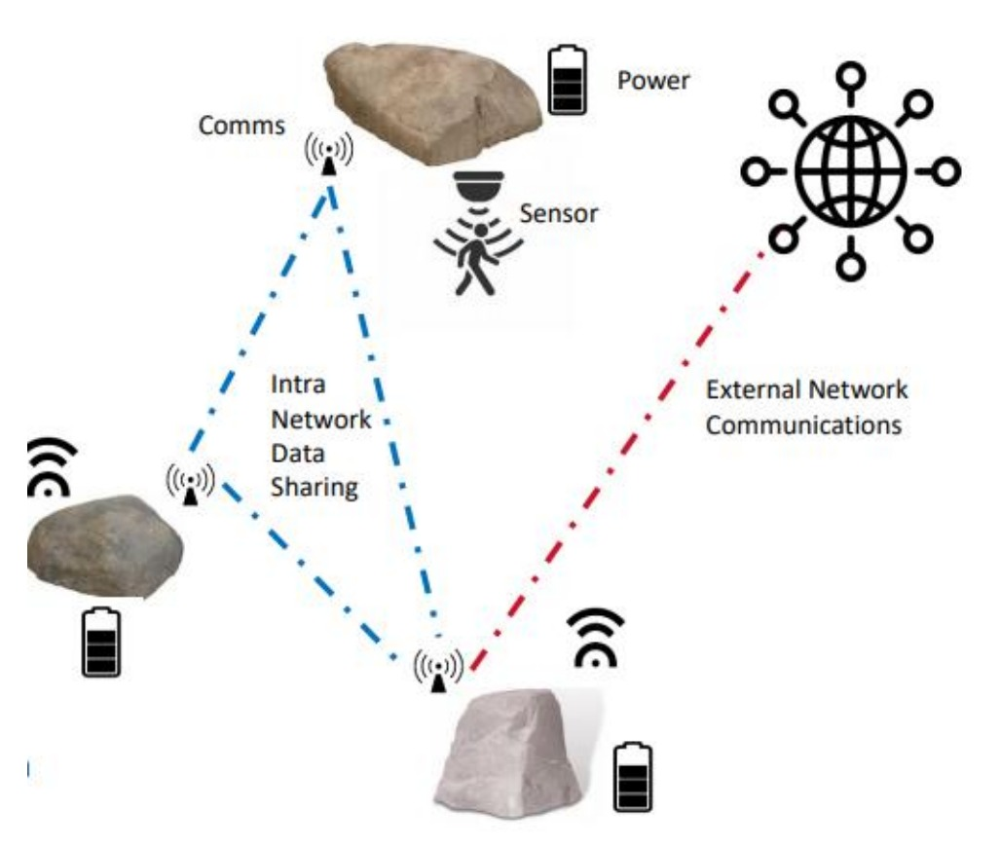

# Smart Rocks - A Network of Covert Smart Sensors

Joint project with the University of Arizona and the University of Massachusetts Lowell.

Sponsored by Raytheon Technologies.

## Project Description

    

### Need
A flexible way to covertly monitor a variety of activities and environmental events in a wide area. Possible uses include border monitoring, security
systems and forest land usage and fire tracking.

### Smart Rock Sensor System Requirements

- Be self powered and covert capable of being disguised in the shape of a rock or other natural element.
- Include a sensing element which is capable of collecting data and recording stimulus from the outside world. This may include sensing of acoustic inputs, seismic, thermal, RF transmissions.
- The design shall be modular such that different sensors can be interchanged across a common interface.
- The sensing elements or nodes shall be able to collect and buffer data when no other nodes or smart-rocks are present. 
- When multiple nodes are in proximity each sensor shall be able to pass data and share information wirelessly with other nodes. 
- The system shall include a method for the local network to connect to a wider or outside network over a defined protocol to share data and receive commands from the outside network. 

### Challenge 

- Work through the hardware and software design process in collaboration with industry sponsors and across a design team at both University of Arizona and University of Massachusetts.

### Category

- Multidiscipline (System, Structures, Software, Electrical, Mechanical, Test)